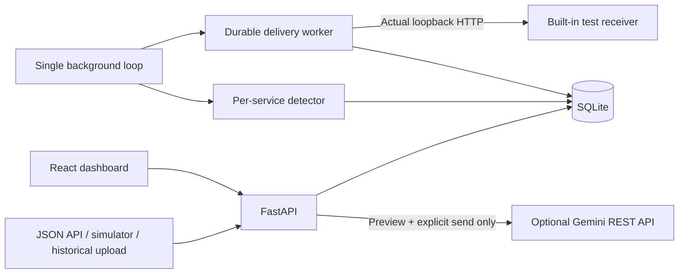

# Log Watchdog

A local, API-first observability console that turns structured logs into an explainable investigation: **Overview → incident → evaluated logs → webhook delivery history**. FastAPI, SQLite and React run as one application. The complete core flow needs no account, paid database or external credentials.

The MVP implements all seven approved issues: ingestion and browsing, statistical error-log-rate detection, evidence-linked investigation, real local HTTP notifications with durable retries, historical JSON uploads, protected seven-day retention and Demo reset, and optional Gemini analysis. It is a single-user localhost tool, not a production monitoring platform.

- **Reproducible:** three seeded services and an accelerated downstream-timeout scenario.
- **Explainable:** observed versus expected error-log rate, evaluated windows, patterns and supporting logs. Missing traffic is not health.
- **Inspectable:** exact webhook payloads, attempt outcomes and restart recovery.
- **Optional AI:** local summary always available; external analysis requires a preview and explicit send.

[Presentation](docs/presentation.md) · [Final validation and limitations](docs/final-validation.md) · [Architecture decisions](docs/adr/decisions.md) · [Prompt audit](prompts.md) · [Tooling](docs/tooling.md)

## Start locally

Prerequisites: Python 3.11+ and Node.js 22+ with npm. Run from this checkout's root. Verified with Python 3.14.5, Node 26.0.0 and npm 12.0.2 on macOS arm64.

```sh
python3 -m venv .venv
.venv/bin/python -m pip install -r requirements-dev.lock
npm --prefix frontend ci
npm --prefix frontend run build
.venv/bin/python -m log_watchdog
```

Alternatively, with `uv` installed, use `uv venv` and `uv pip install -r requirements-dev.lock` for the first two commands. Open **http://127.0.0.1:8000/**. The same server serves the compiled frontend and API; the supported launcher binds only to loopback and uses one worker. Stop with Ctrl+C. The editable package expects this checkout's `frontend/dist/`; it is not a standalone frontend-bundled wheel.

The database defaults to `.data/watchdog.sqlite3` relative to the working directory. To use another database, set `LOG_WATCHDOG_DB=/absolute/path/watchdog.sqlite3` before starting. Restarting preserves events and does not repeat the seed. A new database receives 3,600 synthetic normal events across `api-gateway`, `checkout`, and `worker`, covering 30 minutes ending at 2026-01-01 12:00 UTC. These are labeled simulation timestamps, not current live activity. Historical and Live start empty.

For frontend development, keep the API running and use `npm --prefix frontend run dev`. Vite binds to loopback and proxies `/api` to port 8000. Rebuild to update the dashboard served by FastAPI.

## Five-minute walkthrough

1. Open **Demo Overview**. The simulation is paused; normal history is already seeded. Use **Reset Demo** and confirm only if you want to discard the existing Demo investigation. Live and Historical remain intact.
2. For the retry scenario, open **Deliveries**, choose **Fail first, then succeed** in the receiver controls and save before advancing. Return to Overview. Webhooks run in real time, independently of simulation time.
3. Choose **Advance one minute**. Checkout produces 16 ERROR logs among 40 events (40.00%) and opens an incident. Select **Investigate checkout incident**.
4. Inspect the recorded baseline, threshold and local summary. Open **View evaluated logs**, expand a message, then use Back. **Include later arrivals** explicitly broadens the evidence without changing the recorded measurement.
5. Open **View delivery history**. Inspect the exact opening payload and the real HTTP 503 → 200 attempts. Wait for the real-time retry; advancing simulation does not accelerate it.
6. Advance four more times from Overview. The second abnormal minute updates the same incident; three eligible normal minutes then mark it recovered. Inspect the separate recovery notification.
7. Optionally use **Logs → Historical** to upload a JSON array (5 MB / 5,000 events max). Browse its trends; imported events do not train live baselines or trigger alerts.

The detector compares ERROR/FATAL events divided by **all logs**, not failed requests. It uses a configurable, sample-size-aware statistical heuristic with smoothed history and a minimum increase guard. [Formula, defaults and limitations](docs/detection.md).

## Architecture



Demo, Live and Historical are isolated datasets. Evaluation watermarks preserve recorded evidence despite late logs. SQLite stores incidents, delivery work and attempt history; the single process resumes pending work after restart. Retention protects open investigations and pending notifications. No external webhook destinations, hosting, authentication, chat or agent orchestration are included.

For optional analysis, set `GEMINI_API_KEY` in the **server environment** and restart. `GEMINI_MODEL` is configurable. Verified synthetic Demo evidence is the default eligibility boundary; enabling real-log analysis additionally requires appropriate paid-service configuration and `GEMINI_PAID_SERVICE=true`. Preview the bounded redacted packet, then explicitly **Send for analysis**. Redaction cannot guarantee removal of every secret. No live Gemini call has been verified. [Configuration, privacy and error behavior](docs/analysis.md).

## Ingest and browse

```sh
curl -sS http://127.0.0.1:8000/api/datasets/live/events \
  -H 'Content-Type: application/json' \
  -d '{"events":[{"event_id":"example-1","timestamp":"2026-01-01T12:00:00Z","service":"checkout","severity":"ERROR","message":"Downstream timeout","metadata":{"duration_ms":1500}}]}'
```

Choose **Live** in the dashboard, enter `checkout` in Service and `timeout` in Message contains, then Apply filters. Expand the event to read its ID, full message, ingestion time, and metadata. Filters and page are in the URL; browser Back restores prior context and scroll after loading. Clear filters keeps the selected dataset. Refresh reloads the current query; a failed refresh keeps previous same-query results with a timestamp.

- `POST /api/datasets/{dataset}/events`: accepts `{"events": [...]}` with 1–5,000 events. Dataset is `demo`, `live`, or `historical`. For JSON-array files, use the Historical upload below.
- Required fields: timezone-aware ISO timestamp, nonblank service (up to 120 characters), uppercase severity (`DEBUG`, `INFO`, `WARNING`, `ERROR`, `FATAL`), nonblank message (up to 16,384 characters). Extra fields are rejected.
- Optional fields: `event_id` (nonblank, up to 200 characters) and `metadata` (finite JSON object, serialized size up to 32 KiB). Timestamps normalize to UTC with microsecond precision. Validation errors identify the event index and field without echoing log content.
- A batch is atomic: any validation error (422) or conflicting ID (409) rejects the entire batch. The response gives `event_ids`, `inserted`, and `duplicates`.
- Reusing a supplied ID with identical normalized content deduplicates **within that dataset**, including duplicates inside a batch. Different content conflicts; nothing is overwritten. Metadata key ordering and equivalent timezone offsets do not cause conflicts.
- Omitted or null IDs generate a new UUID every time. **Retrying without a supplied ID does not deduplicate.** Producer retries should supply stable IDs.
- `GET /api/datasets/{dataset}/events`: `service`, `severity`, `start`, `end`, `message`, `page` (default 1), `page_size` (default 50, max 100). Service and severity match exactly; message is literal case-insensitive substring matching using SQLite's built-in lowercasing (ASCII, not full Unicode case folding). Time bounds are inclusive and require a timezone; dashboard inputs use `Z` explicitly.
- General Demo event browsing also accepts `run` (up to 100 characters). A stale run returns HTTP 410 with the reset explanation and no events; run identity, count, and page share one snapshot. Live/Historical ignore the run guard. Logs offers **Return to current demo** after a stale saved URL, refresh, or Back navigation.
- Results include total matching count and newest-first events. Timestamp ties use insertion sequence. Count and page share one database snapshot. Pages are offset-based: new ingestion can move rows between pages across separate requests.
- `GET /api/health` and API schema at `/docs`. Unknown API paths return 404.

Demo, live and historical queries always carry a dataset predicate. Historical events are stored separately and excluded from detection. Demo and live have separate persisted evaluation cursors and baselines. Routine data expires after seven days, with protected-investigation and pending-delivery exceptions; Demo uses simulation time. See [retention clocks and exceptions](docs/lifecycle.md).

## Verify

Stop any running copy of the app before verification: the HTTP tests and runtime script require exclusive use of port 8000. Build precedes backend tests because they verify compiled assets are actually served.

```sh
npm --prefix frontend run build
npm --prefix frontend run typecheck
npm --prefix frontend run lint
npm --prefix frontend run format:check
npm --prefix frontend test
.venv/bin/ruff check log_watchdog tests scripts
.venv/bin/ruff format --check log_watchdog tests scripts
.venv/bin/mypy
.venv/bin/python scripts/check_contrast.py
.venv/bin/pytest -q
.venv/bin/python scripts/validate_runtime.py
```

`validate_runtime.py` requires port 8000 free and starts the documented launcher with a temporary database. It uses real HTTP to check dashboard/assets, ingest 100,000 synthetic live events, time browsing, post 100 individual events at 20/second, and restart to verify persistence and isolation. It also exercises the five-step demo, late evidence, incident restart, pending webhook process restart (HTTP 503 → 200), opening/recovery notification delivery, and one actual live worker minute (up to 75 seconds waiting for the real clock). It stops its server and removes only its temporary files. It never uses your default database.

Backend tests cover schema failures, complete-batch rollback, ID generation/deduplication/conflicts, normalization, literal filters, paging, dataset isolation, seed idempotence, and SQLite restart. Frontend tests cover query/Back restoration (including response timing), same-query actions, dataset races, expansion/focus, loading/empty/error/retry, literal rendering of untrusted messages, and available axe DOM accessibility rules. jsdom cannot establish rendered layout, contrast, or real-browser keyboard behavior. ESLint explicitly permits focusable named `region` elements to make the overflowing table keyboard-scrollable; other accessibility rules remain active.

See [issue #1 evidence](docs/verification-issue-1.md), [issue #2 evidence](docs/verification-issue-2.md), [issue #3 evidence](docs/verification-issue-3.md), [issue #4 evidence](docs/verification-issue-4.md), [issue #5 evidence](docs/verification-issue-5.md), [issue #6 evidence](docs/verification-issue-6.md), and [issue #7 evidence](docs/verification-issue-7.md) for measured results and pending manual UI checks.

## Investigate evaluated evidence

Advance Demo once and activate **Investigate checkout incident**. The queue stays beside the evidence pane on desktop; at narrow widths the pane has **Back to incidents**. Selection and the evaluated window are in the URL and remain pinned during refresh and recovery. Choose **Evaluated window** to inspect another recorded minute, including recovery windows.

The pane shows counts, rate, baseline/threshold, exact-message error patterns, a labeled five-event sample, and a non-LLM local summary with evidence links. **View evaluated logs** opens the full paginated window, initially restricted to the detector's watermark. **Include later arrivals** explicitly expands that same half-open interval and labels excluded additions. Recorded totals and query matching counts stay separate. **Clear filters** removes severity/message/event-ID refinements while keeping incident scope; **Leave incident scope** explicitly enables general service/time exploration. Sample links pin an exact event ID.

`GET /api/datasets/{demo|live}/incidents/{id}/evidence` accepts optional `evaluation` (default latest abnormal window), `run` (Demo UUID), `scope=evaluated|all`, `severity`, literal `message`, exact `event_id`, `page`, and `page_size` (1–100). Service and UTC bounds come from evaluation provenance, never caller-supplied overrides. Patterns show up to ten exact ERROR/FATAL message groups; samples prefer errors and contain at most five events. Basic pattern matching is not root-cause analysis. All evidence reads share one snapshot.

Demo links carry a durable run identity. A mismatched run returns a specific reset explanation; an unavailable incident/window returns 404. If recorded metadata outlives logs, the response flags missing evidence independently of filters. Reset and retention execute transactionally; lifecycle tests cover protected evidence, queued/in-flight work, rollback, restart, and stale run identity. Older links without a run ID retain compatibility but cannot identify a prior reset.


## Import historical JSON

Open **Logs → Historical**, choose a UTF-8 JSON-array file, and activate **Import into Historical**. Limits are inclusive: **5 MB (5,000,000 bytes)** and **1–5,000 events**. Use the same event fields and ID semantics documented above. The file is committed atomically; invalid rows or conflicting IDs reject the whole import. Feedback names row/field and lists up to 100 errors. Reading/uploading status is indeterminate; completion reports inserted and duplicate counts.

Choose **Browse file interval** to set the file's inclusive UTC range and clear unrelated filters, then refine Service, Severity or Message contains. This interval can include previously imported events; it is not a file identity. Trends below the table use applied service/time filters, with at most 30 equal-width buckets rounded up to whole minutes. They include all severities in the ERROR/FATAL denominator; severity/message refinements affect only the log table. Empty buckets show no traffic, not health. Expand **Exact historical trend values · UTC** for the accessible numeric table.

Imports persist across restart and never train Demo/Live baselines or create incidents/deliveries. Supplied IDs deduplicate only within Historical. Missing/null IDs generate fresh events on every import: after a connection failure, inspect Historical before retrying because the server may already have committed the file. The selected file remains available after failure.

- `POST /api/historical/upload`: raw UTF-8 JSON array (not multipart), with required `Content-Type: application/json` (optional charset parameter). Unsupported or missing media types return 415 before ingestion. Bounded during request streaming; returns inserted/duplicate counts, event IDs, Historical dataset and the file's UTC start/end. Optional UTF-8 BOM accepted.
- `GET /api/historical/trends`: optional exact `service`, inclusive timezone-aware `start`/`end`; returns aggregate volume and error-log rate buckets. No detector baseline or live-incident semantics.

See [the synthetic upload walkthrough and verification](docs/verification-issue-5.md). Run backend tests and runtime validation sequentially: both require loopback port 8000.

## Reset Demo

In Demo Overview, choose **Reset demo**, then **Confirm reset Demo only**. This clears Demo investigation and delivery history, restores normal seeded history and receiver defaults, and leaves Live/Historical untouched. Cancellation, progress, outcome and stale-run errors are explicit. See [the reset walkthrough and retention limits](docs/lifecycle.md).
