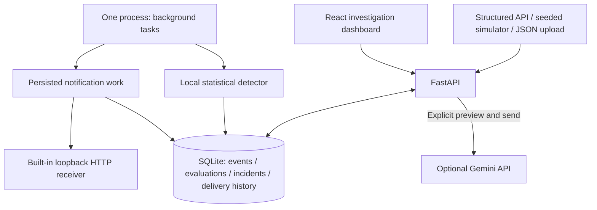

# Log Watchdog

## Explainable local incident investigation

**AI-generated presentation · 20 September 2026**

Python / FastAPI · SQLite · React

From structured logs to a recorded incident, supporting evidence and inspectable HTTP notification delivery. A local single-user MVP with no external credentials required for the core flow.

---

## 1. The problem and the bounded answer

An error spike is useful only if a developer can understand what changed, inspect the evidence, and see whether its notification arrived.

Log Watchdog connects four steps:

**Overview → incident → evaluated logs → delivery history**

The MVP deliberately excludes arbitrary text parsing, platform connectors, multi-user hosting, assignment and escalation. It demonstrates one complete investigation rather than a broad integration catalog.

Speaker note: “Intelligent” means local statistical detection plus optional evidence-assisted explanation. It does not mean autonomous remediation or a claim of definitive root cause.

---

## 2. A repeatable story in five advances

| Advance | Checkout behavior | Investigation |
|---|---|---|
| Seed | 30 normal minutes across three services | Baseline ready |
| 1 | Repeated downstream timeouts; 16/40 ERROR logs | Incident opens |
| 2 | Another 40% error-log-rate window | Same incident updates |
| 3–4 | Eligible normal windows | Recovery progress 1/3, 2/3 |
| 5 | Third eligible normal window | Incident recovers |

The simulation clock accelerates the scenario. HTTP delivery and retries remain in real time. Missing traffic never proves recovery.

Speaker note: Follow “Try the Demo” on Overview: Reset Demo, configure “Fail first, then succeed” in Deliveries, save, then advance. Show the actual 503 → 200 attempts before completing recovery.

---

## 3. One local application

One server serves API and built dashboard on localhost. No cloud compute, hosted database/storage or deployment resources were provisioned. GitHub and AI tools supported development; optional Gemini is an external API.

---

## 4. Detection that can be explained

**Error-log rate = ERROR/FATAL logs ÷ all logs for one service and minute.**

It is not failed-request rate. A service is compared against its own recent normal history. Smoothed proportions and a sample-size-aware uncertainty term combine with a configurable minimum increase guard.

The dashboard shows observed rate, expected baseline, threshold, counts and evaluated interval. Sparse history is explicitly “learning baseline.” The baseline freezes during an incident, and consecutive abnormal windows remain one investigation.

Speaker note: The threshold is a practical statistical heuristic, not a calibrated failure probability. See [the formula and configuration](detection.md).

---

## 5. Evidence stays consistent

- Each evaluated window records its ingestion watermark and denominator.
- Incident links initially open evaluated evidence.
- “Include later arrivals” broadens the same interval and labels excluded additions.
- Patterns, a representative sample and the local summary link back to supporting logs.
- URL selection and Back behavior preserve investigation context.

Overview remains a summary; Investigate opens the Incidents queue/evidence workspace. Logs and delivery actions lead the pane, lifecycle detail is disclosed separately, and Gemini follows the local summary before sample logs. Light/dark themes share the same layout and readable state colors.

---

## 6. Delivery is part of the investigation

Opening and recovery generate separate notifications. Updates do not send duplicates.

The built-in receiver supports Success, Fail first then succeed, and Always fail. The application makes actual loopback HTTP requests, persists payloads and attempts, retries at most three times, and resumes pending work after restart.

Incident recovery and notification success are separate facts. The dashboard shows payload, response, retry timing and exhaustion without claiming exactly-once network delivery.

---

## 7. Local by default, external analysis by choice

The non-LLM **Local evidence summary** is always available.

Optional Gemini analysis accepts a server-memory-only key through **Gemini setup**, with an environment-key fallback, then requires an exact bounded redacted evidence preview and an explicit **Send for analysis** click. Clear key removes the session override; no key is returned to the UI. It returns evidence-linked summaries, possible causes and next checks. It cannot fire alerts or execute actions.

Unpaid access is limited to trusted simulator evidence. Real-log eligibility requires appropriate paid-service configuration. Redaction cannot guarantee removal of all secrets. Model references are validated for membership, not truth.

**Verification boundary:** controlled-response tests passed during the issue workflow; no live provider call, account quota or output-quality assessment has been verified.

---

## 8. Data boundaries and lifecycle

| Dataset | Purpose | Detection |
|---|---|---|
| Demo | Isolated, seeded simulation | Simulation clock |
| Live | Structured API events | Real-time completed windows |
| Historical | JSON uploads and exploration | No alerts or baseline training |

Uploads are atomic and bounded to 5 MB / 5,000 events. Supplied stable IDs enable dataset-scoped deduplication. Seven-day retention preserves open investigations, their evidence and pending deliveries. Reset clears and reseeds only Demo; old run URLs explain the reset.

---

## 9. Delivery discipline and evidence

All seven issues completed the gated workflow:

**Fresh implementation → PR → independent read-only review → fixes → fresh review → merge**

Reviews caught navigation, return-focus, upload validation, stale-run and malformed-provider-response defects. Fixes gained regression coverage before merge.

The final validation record distinguishes tests from runtime measurements, controlled provider responses from real network calls, and source/DOM checks from rendered verification. See [final validation](final-validation.md) for current counts, review outcome and limitations.

The 100k-event and roughly 20-events/second exercises are synthetic validation targets, not production guarantees.

---

## 10. Handoff and remaining validation

Run the app using the [README](../README.md), then demonstrate the five-advance scenario and inspect delivery attempts. The [architectural decisions](adr/decisions.md), [tooling inventory](tooling.md), [prompt audit](../prompts.md) and [verification record](final-validation.md) preserve how it was built.

Playwriter headless Chrome verified desktop/narrow flows, keyboard/Back/Forward, Historical import, Gemini setup and both themes. Current frontend: 97 passing tests plus build/type/lint checks. Earlier full backend/runtime and later targeted checks are scoped in the validation record. Remaining limits: physical devices, other engines, full zoom/screen-reader audit and live Gemini access/output quality.

No external submission, deployment or presentation publication has been performed.
